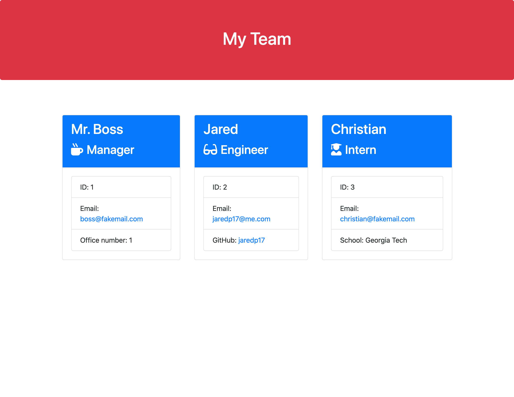

# gt-hw-employee-summary


## Description

A Node CLI that takes in information about employees and generates an HTML webpage that displays summaries for each person.

## Table of Contents

* [Installation](#installation)

* [Usage](#usage)

* [Preview](#preview)

* [Demo](#demo)

* [License](#license)

* [Contributing](#contributing)

* [Tests](#tests)

* [Questions](#questions)

## Installation

To install necessary dependencies, run the following command:

```
npm i
```

## Usage

Clone repo, install dependecies, run `node app.js`, and follow the prompts.

## Preview



## Demo

Click here to view demo: [video](https://drive.google.com/file/d/1f9BQzq0ZqvucleKm3YaeisW55dxo_xPF/view)

## License

This project is licensed under the MIT license.

## Contributing

I am the sole contributor.

## Tests

```
npm run test
```

## Questions

If you have any questions about the repo, open an issue or contact me directly at jaredp17@me.com. You can find more of my work at [jaredp17](https://github.com/jaredp17/).